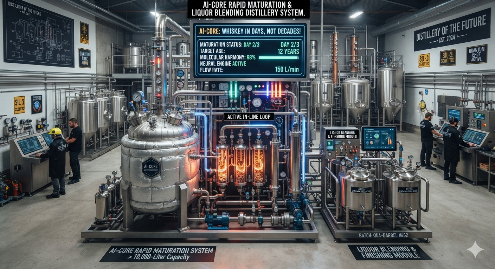

# 🥃 AI-CORE RAPID MATURATION & LIQUOR BLENDING DISTILLERY SYSTEM
> **Welcome to the Future of Distilling!** Breaking the 10-year barrel barrier and redefining the liquor industry through Quantum Particle Physics, Industrial AI, and SIL-3 Automated Hardening.



---

## 🌟 OVERVIEW: ACCELERATING THE 10-YEAR AGING CURVE INTO A 2-YEAR HYBRID CYCLE!
For centuries, the liquor industry had a massive problem: **Time**. To make a premium bottle of Chivas Regal, Johnnie Walker, or Hennessy, master blenders had to lock away capital inside wooden barrels for 10 to 30 years, praying that the weather, wood quality, and "Angel's Share" evaporation wouldn't ruin the batch.

**Not anymore.** 

This repository contains the complete industrial framework, software blueprints, and functional safety architecture for a **10,000-Liter Automated Rapid Maturation & Blending Facility**. By forcing raw spirits through an active, high-velocity **In-Line Loop** controlled by a multi-layered Neural Engine, we achieve the perfect molecular harmony, rich wood extraction, and complex flavor profiles of a 12-year-old aged spirit **in just a few days!**

---

## ⚡ TECH STACK & SYSTEM BREAKDOWN

This project bridges advanced data science, quantum mechanics, and heavy automation. The codebase and documentation are structured across 4 critical pillars:

### 1. 🧠 Core AI Engine (`core_ai/`)
The brain of the facility operating 24/7 in total darkness to eliminate light-driven product oxidation:
*   `pre_flight_check.py`: The automated aerospace-grade safety checklist. It scans network connections, pings the PLC, and verifies sensor calibrations before permitting a single drops of alcohol to move.
*   `dynamic_optimizer.py`: The real-time feedback loop. It computes a molecular delta matrix between the Inlet and Outlet sensor arrays, dynamically modulating pump speeds and energy field outputs.
*   `blending_engine.py`: A linear optimization model utilizing Scipy's SLSQP algorithm. It calculates the exact, down-to-the-milliliter blending ratios across different raw vats to match a signature flavor profile perfectly.
*   `drift_detector.py`: Uses **Mahalanobis Distance** and **Hotelling's T² Ellipse** metrics to detect agricultural anomalies (such as seasonal soil or grain changes), protecting the machine learning model from invalid tracking.

### 2. 🛡️ Industrial Safety & PLC Layer (`plc_safety/`)
AI can hallucinate or crash, but a chemical plant cannot. We enforce a strict separation between the AI Control Layer and the **SIL-3 / PL e Certified Safety Layer**:
*   `watchdog_timer.ld`: Hardwired Ladder Logic for an Allen-Bradley GuardLogix processor. It monitors a sub-second heartbeat from the Python server. If the AI hangs for more than **2000ms**, the PLC takes absolute control, trips the main power contactors, and isolates the 10,000L tank.

### 3. 🔒 Cyber Security & Network Topology (`config/`)
Isolating operational technology (OT) from external IT networks using the industry-standard Purdue Model:
*   `firewall_rules.iptables`: Strict deep packet filtering blocking all corporate web entry, permitting exclusive CIP communication on Port 44818.
*   `docker-compose.yml`: Implements a hot-swappable **Blue-Green Deployment** pipeline. New PLSR model coefficient maps can be pushed live onto the Edge node without stopping pumps.
*   `sap_oracle_api.json`: Standardized RESTful OData integration mapping, pushing unalterable batch records directly into enterprise resource planning software.

### 4. 📝 Engineering Blueprints & Compliance (`docs/`)
*   `PANDID_Symbol_Key.md`: Standardized instrumentation naming maps compliant with **ISA-5.1 framework rules**.
*   `HMI_ISA101_Mockup.txt`: High-Performance, gray-scale desaturated 3-monitor control interface layout to reduce operator cognitive fatigue.
*   `cip_sanitation_matrix.md`: Automated three-phase high-shear chemical wash routines (NaOH + Peracetic Acid) to prevent sensor bio-fouling.
*   `sil3_proof_testing.md`: Documented validation schedules required by fire marshals and safety inspectors to maintain the plant's operational license.

---

## 📊 REVOLUTIONARY OPERATIONAL KEY METRICS

By transitioning spirit maturation from a passive storage method to a highly precise chemical engineering asset, the system delivers unmatched Key Performance Indicators (KPIs):

*   **Production Acceleration**: Compresses a 10-year traditional aging curve down to **under 3 days** of active processing.
*   **Angel's Share Mitigation**: Drops fluid evaporation losses from a standard **20% down to less than 4%**, maximizing yield.
*   **CapEx Footprint Reduction**: Slashes structural warehouse storage area requirements by **70%**, freeing up frozen working capital.
*   **Flawless Uniformity**: Inline NIR Lasers and E-Tongues track batches with a coefficient of determination of **R² ≥ 0.94** against master GC-MS baselines.
*   **Immutable Traceability**: Automatically compiles grain lot numbers and Critical Control Point logs into an append-only ledger secured by **SHA-256 cryptographic hashes** for 100% FDA compliance.

---

## 🛠️ HOW TO DEPLOY ON THE EDGE HARDWARE

### 1. Initialize the Industrial Directory
```bash
git clone https://github.com
cd ai-core-rapid-maturation-distillery
```

### 2. Apply Industrial Network Firewall Constraints
```bash
sudo iptables-restore < config/firewall_rules.iptables
```

### 3. Spin Up the Blue-Green AI Containers
```bash
docker-compose up -d plsr_model_blue
```

### 4. Run Pre-Flight Mechanical Authorization
```bash
python3 core_ai/pre_flight_check.py
```

---

## 📜 LICENSE & REGULATORY NOTE
This project is licensed under the MIT Framework. All sub-system routines are designed to meet **OSHA, NFPA 30 (Flammable Liquids), and FDA 21 CFR Part 11 regulations**. Custom modifications to the E-Beam energy thresholds require a re-evaluation of local NRTL fields by safety engineers.

---
*Developed with ❤️ by the Global Systems Automation & Spirit Engineering Team. Join the revolution and stars this repo!*
